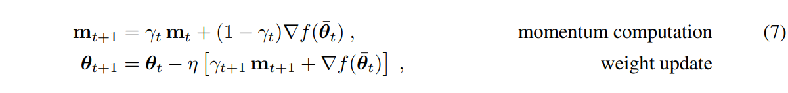

# 🚀 Momentum Look-Ahead for Asynchronous DiLoCo – PyTorch Implementation

This project is a research-oriented PyTorch implementation of the paper:

> **"Momentum Look-Ahead for Asynchronous Distributed Low-Communication Training"**  
> *Published at ICLR 2025*  
> [arXiv Link](https://openreview.net/pdf?id=4O8nzTkHPI)

We simulate asynchronous training with 4 local workers and a central parameter server using LeNet on the CIFAR-10 dataset.

---

## 📌 Features

- ✅ Asynchronous worker training (no synchronization)
- ✅ Central server applies **Momentum Look-Ahead** updates (per paper Eq. 7)
- ✅ Modular architecture with real-time threading
- ✅ Clean, research-style code (easy to extend to multi-machine)

---

## 🧠 Paper Idea in Short

Instead of waiting for all workers to sync, each one sends updates (∆θ) asynchronously.  
The server uses:



This approach improves convergence in heterogeneous hardware setups.

---

## 📁 Project Structure

```bash
async_diloco_pytorch/
├── main.py # Launches async training and evaluation
├── models/
│ └── lenet.py # LeNet-5 CNN model for CIFAR-10
├── datasets/
│ └── cifar_loader.py # CIFAR-10 DataLoader
├── server/
│ └── async_server.py # Momentum Look-Ahead server logic
├── workers/
│ └── async_worker.py # Async local training worker (threaded)
└── README.md
```

---

## ⚙️ Installation

```bash
git clone https://github.com/rafey1104/async_diloco_pytorch.git
```

```bash
conda create -n async-diloco-env python=3.10 -y
conda activate async-diloco-env
pip install torch torchvision matplotlib
```

---

## 🚀 Usage

```bash
python main.py
```bash

> The default configuration runs for **30 seconds** with 4 workers.

---

## 🔍 Example Output

```bash
[Server] Running...
[Worker 0] Starting.
[Worker 1] Starting.
[Worker 2] Starting.
[Worker 3] Starting.

[Main] Running training for 30 seconds...
[Server] Shutting down.
[Eval] Accuracy: 31.59%
```

---

## 🛠 Configuration (in `main.py`)

| Param         | Meaning                            | Example Value |
|---------------|------------------------------------|---------------|
| `NUM_WORKERS` | Number of async threads            | 4             |
| `INNER_STEPS` | Local SGD steps before sending     | 5             |
| `SERVER_LR`   | Learning rate at server            | 0.7           |
| `MOMENTUM`    | γ for momentum buffer              | 0.9           |
| `TRAIN_SECONDS`| How long to train asynchronously | 30            |

---

## 🙏 Acknowledgments

Based on the paper by Ajanthan et al., published at ICLR 2025. Inspired by the official [DeepMind async DiLoCo repo](https://github.com/google-deepmind/asyncdiloco).
"""
